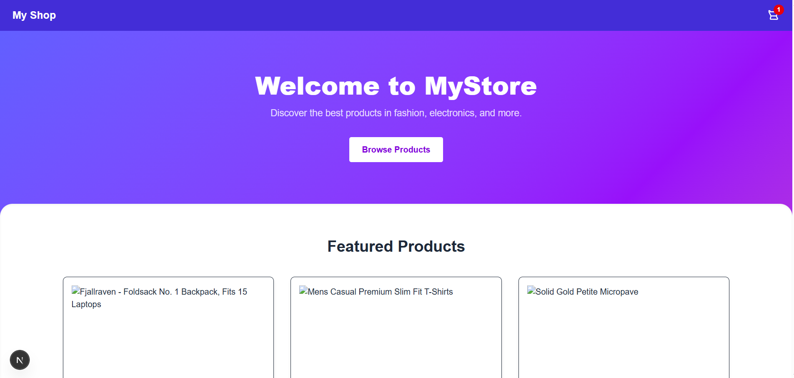
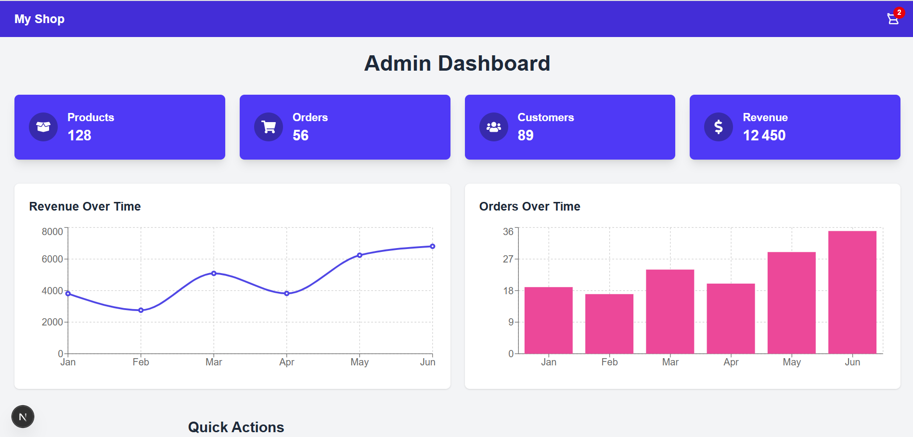

# Next.js eCommerce Admin Panel



A full-featured **Next.js 13+ eCommerce admin panel** with:

- Product CRUD (Create, Read, Update, Delete)
- Google Authentication (via NextAuth)
- SQLite + Prisma database
- Stripe integration for checkout
- Animated UI with Framer Motion
- Recharts/Chart.js analytics for revenue & orders
- Responsive design with Tailwind CSS

---

## Table of Contents     

- [Features](#features)  
- [Screenshots](#screenshots)  
- [Tech Stack](#tech-stack)  
- [Installation](#installation)  
- [Database Setup](#database-setup)  
- [Environment Variables](#environment-variables)  
- [Usage](#usage)  
- [License](#license)  

---

## Features

- **Products Management**: Add, edit, delete products with animated forms
- **Orders & Customers**: CRUD pages with charts & analytics
- **Authentication**: Sign in with Google
- **Stripe Checkout**: Connect your store to Stripe for payments
- **Responsive UI**: Works on desktop & mobile
- **Smooth Animations**: Using Framer Motion for modal forms, tables, and buttons

---

## Screenshots

### Admin Dashboard



### Product Management Page


---

## Tech Stack

- **Next.js 13+** (App Router)  
- **React** + **Zustand**  
- **Tailwind CSS**  
- **Framer Motion** (animations)  
- **Prisma** + **SQLite** (database)  
- **NextAuth.js** (Google authentication)  
- **Stripe** (checkout & payments)  
- **Recharts / Chart.js** (analytics)

---

## Installation

1. Clone the repo:

```bash
git clone https://github.com/abdellahaarab/Next.js-eCommerce-Admin-Panel.git
cd your-repo
````

2. Install dependencies:

```bash
npm install
```

---

## Database Setup

1. Generate Prisma client:

```bash
npx prisma generate
```

2. Run migrations:

```bash
npx prisma migrate dev --name init
```

This will create a `dev.db` SQLite file with the schema for products and users.

---

## Environment Variables

Create a `.env.local` file:

```env
DATABASE_URL="file:./dev.db"
NEXTAUTH_URL=http://localhost:3000
GOOGLE_CLIENT_ID=your-google-client-id
GOOGLE_CLIENT_SECRET=your-google-client-secret
STRIPE_SECRET_KEY=your-stripe-secret-key
NEXT_PUBLIC_BASE_URL=http://localhost:3000
```

---

## Usage

Start the development server:

```bash
npm run dev
```

* Visit `http://localhost:3000/admin/products` to manage products
* Visit `http://localhost:3000/admin/orders` to manage orders
* Sign in with Google to access admin features

---

## License

This project is licensed under the MIT License.

---

> Built with ❤️ by \[Abdellah Aarab]


